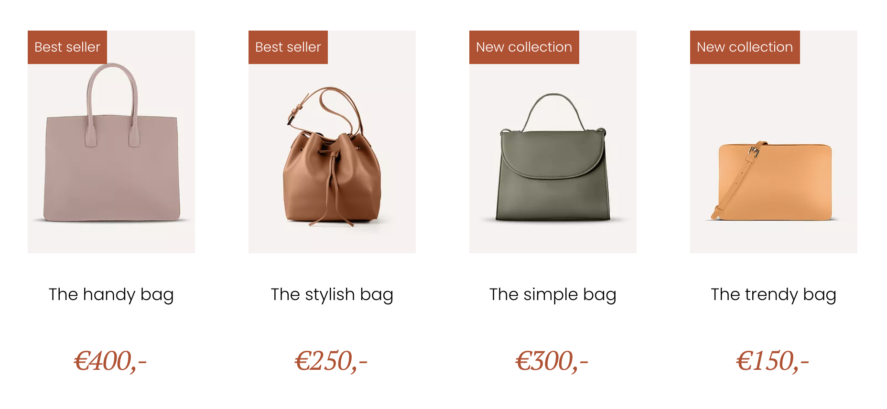

# Opdrachtbeschrijving

## Inleiding
Persoonlijk heb je helemaal niets met tassen (je bent immers een nerdy developer) maar je hebt gezien dat de website van die peperdure tassenwinkel om de hoek wel wat beter gestructureerd kan worden.
Je bent erachter gekomen dat de webshop gebouwd is in React, en wil daarom direct wat aanpassingen maken. Zo zijn er een aantal onderdelen op de webshop die omgevormd kunnen worden tot herbruikbare componenten,
die je data kunt doorgeven via properties. Alle styling is toegepast met type selectors, dus zodra je de juiste semantische HTML elementen gebruikt, kun je de styling met rust laten.

Het project is opgezet met [Create React App](https://github.com/facebook/create-react-app).

## Eindresultaat
Uiteindelijk zal de website er weer zo uit komen te zien. De gebruiker zal onze technische verbeteringen niet zien, dus eigenlijk gaat het eindresultaat vooral om de code.

## De applicatie starten
Als je het project gecloned hebt naar jouw locale machine, installeer je eerst de node_modules door het volgende commando in de terminal te runnen:

`npm install`

Wanneer dit klaar is, kun je de applicatie starten met behulp van:

`npm start`

of gebruik de WebStorm knop (npm start). Open http://localhost:3000 om de pagina in de browser te bekijken.
Begin met het maken van wijzigingen in `src/App.js`: elke keer als je een bestand opslaat, zullen de wijzigingen te zien zijn op de webpagina.

## Hoe je deze opdracht gaat maken
* Je hoeft zelf geen styling toe te voegen aan de applicatie, die verschijnt vanzelf.
* We volgen telkens het format waarin je de elementen eerst meerdere keren herhalend uitschrijft in `App.js` en er dáárna een component van maakt.

## Stappenplan
### Buttons

1. Plaats drie buttons op de pagina, omwikkeld door een `nav`-element. Als je op de buttons klikt, moet de buttontekst in de console verschijnen. De laatste van de drie is disabled.
2. Maak nu een custom `Button`-component die alle benodigde data kan ontvangen, zodat hij voor alle drie de huidige uitvoeringen te gebruiken is. Vervang de huidige buttons door jouw
   custom component en geef de juiste informatie mee.

### Producten

1. Maak een omwikkelende `main`-tag voor de producten. Stop daar vier `article`-elementen in zoals op bovenstaande afbeelding, met:
   * Een `span` voor het rode label
   * De afbeelding van de tassen
   * Een `p` voor de naam van de tas
   * Een `h4` voor de prijs
2. Maak nu een custom `Product`-component die alle benodigde data kan ontvangen, zodat hij voor alle vier de huidige uitvoeringen te gebruiken is. Vervang dan de huidige product-blokken
   door jouw custom component en geef je juiste informatie mee.

### Tegels
1. Maak een omwikkelende `footer`-tag voor de tegels. Maak vier `section`-elementen met daarin:
   * Een afbeelding van het merk of de designers (als er _geen_ tekst in staat)
   * Een `h2`-element voor de titel en `p`-elementen voor de paragrafen (als er _wel_ tekst in staat)
2. Maak nu een custom `Tile`-component die alle benodigde data kan ontvangen. Als er een afbeelding wordt meegegeven gedraagd hij zich als een foto-tegel, maar zonder afbeelding is het
   een tekst-tegel. Houd er rekening mee dat je van tevoren ook niet weet hoeveel losse paragrafen er in een `Tile` komen te staan.
